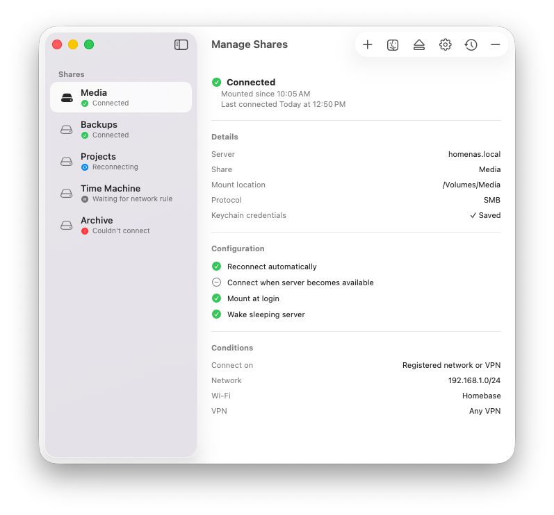

<p align="center">
  
</p>

# 🦦 Otter

<p align="center">
  <a href="https://github.com/maxhewett/ShipHook"></a>
  
  
  <a href="LICENSE"></a>
  
</p>

A lightweight native macOS menu bar app that quietly keeps your network drives connected.

Otter automatically reconnects SMB shares after sleep, network changes, VPN reconnects, or unexpected disconnects, so Finder, Plex, backup jobs, and other apps always have access to the volumes they expect.

Built entirely in Swift, Otter is designed to feel at home on macOS: fast, efficient, and unobtrusive.

<p align="center">
  
</p>

## Why "Otter"?

Otters are small, quick, and famously good at not letting important things drift away. This app does the same for your network volumes: it keeps a quiet paw on the shares you care about and nudges them back into place when sleep, Wi-Fi, or VPN tides pull them loose.

## Features

- 📁 Keeps SMB shares mounted through sleep, wake, network changes, and unexpected disconnects
- 🔒 Connects on a registered network or over VPN, with automatic connection for supported VPNs and server checks for app-managed providers such as WireGuard
- 🧭 Guides setup with mounted-share import, SMB discovery, the native macOS share picker, and a Connection Readiness test
- 🔌 Handles slow or sleeping servers with reachability monitoring, Wake-on-LAN, hostname fallback, and safe recovery tools
- 🔐 Stores credentials in Keychain and keeps passwords and private identifiers out of exports, diagnostics, and support packages
- ⏸️ Provides flexible pause controls, actionable notifications, and Shortcuts actions for everyday management
- 🏢 Supports versioned configuration transfer and managed deployment through MDM ([configuration reference](docs/managed-deployment.md))
- 🍎 Runs as a lightweight native menu bar app with launch-at-login and automatic updates

No scripts. No daemons. No fuss.

Just an otter that never lets go.

## How it works

Otter watches for the moments shares tend to drop—wake from sleep, network path changes, volumes mounting or unmounting—and checks that each configured share is still where it should be. If one is missing, it remounts it using the native macOS NetFS APIs, with retry backoff when the server isn't reachable yet. Shares with Wake-on-LAN enabled send a magic packet before retrying an unreachable server. A low-frequency fallback check catches anything the system events miss.

The first-run assistant can import shares already mounted in Finder, show nearby SMB servers, or take you to manual setup. Browsing a nearby server uses macOS's native authentication and share-selection UI, so credentials continue to be handled by the system and Keychain. The same options remain available later when adding another share.

## Using Otter

1. Open Otter and follow the first-run assistant.
2. Import a mounted Finder share, choose a nearby SMB server, or enter an address manually.
3. Review the share and save it.
4. Optional: add a network condition, Wake-on-LAN details, or "connect when reachable" behavior.

Connection paths are configured per share. Otter can register the network where a share was set up (its IPv4 subnet, plus the Wi-Fi name when available) and connect whenever the Mac is back on that network — over Wi-Fi or Ethernet. A VPN can be enabled as an alternative path for use away from that network. Otter connects the selected VPN automatically when macOS allows it; for app-managed VPNs such as WireGuard, a live tunnel triggers a server reachability check because macOS does not expose the exact profile name to other apps. If Otter cannot confirm that the selected VPN is active and the server does not answer, the share waits quietly instead of reporting an error. A confirmed VPN, a manual connection attempt, or a previously connected share can still surface a genuine connection problem.

For hostname-based shares, Otter resolves ordinary hostnames and Bonjour SMB service identities to learn the server's local IP address while you are on the local network. The hostname always remains the primary address; the IP is a fallback for situations such as a VPN that cannot resolve Bonjour or `.local` names. Otter keeps a small private history of address changes and warns after repeated changes within 30 days, which can indicate that a DHCP reservation would make fallback connections more reliable. To let macOS authenticate the IP-based fallback, Otter may create a scoped alias of the Finder-saved credential in macOS Keychain. Otter removes its alias when the cached IP changes or the share is deleted. Learned addresses and their history are excluded from exported configurations and redacted diagnostic reports.

## Requirements

- macOS 15.0 or later on Apple silicon or Intel. Otter is visually optimized for macOS Tahoe 26 and uses native controls on macOS Sequoia 15.
- Matching by Wi-Fi name needs Location Services access (macOS only exposes Wi-Fi network names to apps with location permission — Otter will ask when needed). Subnet-based matching works without it.
- Local Network access may be requested so Otter can check server reachability

## Building

Open `Otter.xcodeproj` in Xcode 26 or newer and run the `Otter` scheme. The app targets macOS 15.0 and the only dependency is [Sparkle](https://sparkle-project.org), fetched automatically via Swift Package Manager.

Run the tests with:

```sh
xcodebuild test -project Otter.xcodeproj -scheme Otter -destination 'platform=macOS'
```

## License

Otter is open source under the [MIT License](LICENSE). You're free to use, modify, and redistribute it — just keep the copyright notice, which credits the original app.
